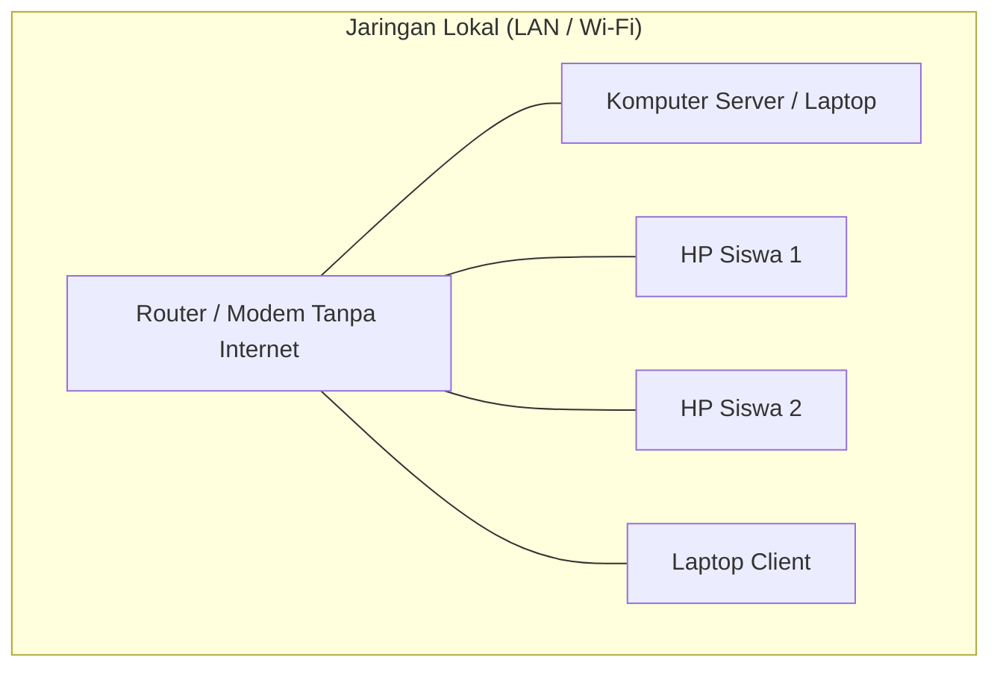

# Mapel DwiSma — Sistem Pemilihan Kelompok Mata Pelajaran SMA Berbasis AI (Artificial Intelligence) dan Analisis Data Akademik - Online & Offline Menggunakan Jaringan Lokal

[](https://nodejs.org/)
[](https://expressjs.com/)
[](https://sqlite.org/)
[](https://docker.com/)

Aplikasi web cerdas berbasis Node.js yang terintegrasi dengan **Kecerdasan Buatan (AI)** untuk memfasilitasi pemilihan kelompok mata pelajaran (peminatan) bagi siswa SMA secara personal dan presisi. Dilengkapi dengan teknologi *Edge AI*, aplikasi ini memproses analisis psikotes, nilai akademik, dan minat karir langsung di perangkat. Dirancang untuk berjalan **100% secara offline** di jaringan lokal (LAN), sistem ini tidak memerlukan koneksi internet untuk memuat library CSS/JS, model AI, maupun font. Nama, logo, dan tahun ajaran dapat dikustomisasi langsung dari dashboard admin.

---

## ✨ Fitur Utama

### 👨‍🎓 Portal Siswa
- Login dengan **NISN + Tanggal Lahir**
- Rekomendasi paket mapel cerdas berbasis **AI (TensorFlow.js)** yang menganalisis nilai akademik, psikotes, dan minat karir secara *real-time*.
- Visualisasi rekomendasi dengan sistem lencana warna (Biru, Hijau, Kuning, Merah).
- Unduh **Surat Persetujuan Orang Tua** (DOCX, auto-fill) yang menyertakan ringkasan hasil analisis.

### 🛡️ Dashboard Admin / Guru BK
- **Visual Monitoring:** Grafik real-time status pemilihan dan popularitas paket (Chart.js) pada tab Dashboard Utama.
- **Kontrol Sistem (di tab Paket Mapel):**
  - **Papan Pengumuman:** Sampaikan informasi penting langsung ke dashboard siswa.
  - **Tutup Otomatis:** Setel deadline (batas waktu) agar sistem terkunci otomatis.
  - **Toggle Pendaftaran:** Buka/tutup akses form pemilihan siswa secara manual.
- **Eksport Laporan:** Download rekap akhir seluruh pilihan siswa dalam format Excel (.xlsx) di tab Monitoring.
- **Reset Pilihan:** Fitur khusus admin untuk me-reset pilihan siswa agar bisa memilih ulang.
- **Manajemen Data:** Monitoring real-time, import/export data siswa, dan manajemen paket mapel.
- **Keamanan & Backup:** Backup & restore database (`.sqlite`) serta pengaturan identitas aplikasi.
- **Offline & LAN Ready:** Seluruh aset statis (Tailwind, FontAwesome, SheetJS, Chart.js, TensorFlow.js) disimpan secara lokal. Aplikasi tetap berfungsi penuh tanpa koneksi internet luar.
- **Edge AI Processing:** Analisis rekomendasi diproses langsung di perangkat siswa (Client-side), menjaga privasi data dan kecepatan respon tanpa membebani server.


---

## 🔒 Keamanan & Hardening
- **Directory Protection:** Mencegah akses langsung ke folder `/backend/` via URL
- **Rate Limiting:** Proteksi brute-force pada login (10 req/15 mnt) dan spam API pemilihan (3 req/5 mnt)
- **Parameterized Queries:** Mencegah celah SQL Injection di seluruh endpoint API
- **Session Security:** Autentikasi menggunakan JWT (JSON Web Token) yang aman
- **File Upload Security:** Nama file upload di-hardcode (logo.png, database.sqlite) untuk mencegah LFI/RCE
- File `.env`, database (`.sqlite`), dan folder `uploads/` tidak ter-commit ke Git (lihat `.gitignore`)
- JWT Secret **wajib diganti** sebelum deploy ke production

## 🛠️ Teknologi

| Layer | Teknologi |
|-------|-----------|
| Frontend | HTML5, Vanilla JS, Tailwind CSS (Self-hosted) |
| Backend | Node.js, Express.js |
| Database | SQLite3 (portable, tanpa instalasi tambahan) |
| Auth | JWT + Bcrypt |
| AI Engine | TensorFlow.js (Neural Network Client-Side) |
| Dokumen | Docxtemplater, ExcelJS, Multer |

---

## 🧠 Sistem Rekomendasi Cerdas (AI)

Aplikasi ini dilengkapi dengan modul **Edge AI** menggunakan library **TensorFlow.js** untuk memberikan saran pemilihan paket yang sangat personal.

### ⚙️ Bagaimana AI Bekerja?
Sistem menggunakan model **Artificial Neural Network (ANN)** yang dilatih secara dinamis di sisi klien untuk memproses 3 variabel utama:

1.  **🤖 Analisis Minat Karir (AI Karir)**: 
    Sistem mengekstrak dan memproses input cita-cita/karir siswa melalui metode NLP sederhana yang terintegrasi dengan **Sistem Voting Mayoritas (Majority Voting System)**.
    - **Kamus Komprehensif**: Terhubung dengan database ratusan kata kunci profesi yang dikategorikan ke dalam *Eksakta* (Kesehatan, Teknik, IT, Sains) dan *Non-Eksakta* (Hukum, Bisnis, Media, Seni, Sosial).
    - **Algoritma Voting**: Jika siswa menginput lebih dari satu karir (misal: "Dokter, Jaksa, Hakim"), sistem akan menghitung bobot masing-masing kategori dan mengambil keputusan berdasarkan suara terbanyak (dalam kasus ini: Non-Eksakta).
    - **Visualisasi UI**: Hasil analisis karir ini tidak hanya diproses di latar belakang, tetapi juga ditampilkan secara transparan berupa *badge* (Eksakta/Non-Eksakta) di Dashboard Siswa dan Tabel Manajemen Admin.

2.  **📈 Korelasi Akademik**: Mencocokkan nilai mata pelajaran pendukung (Matematika, IPA, IPS, Bahasa) dengan profil paket yang tersedia.
3.  **🧠 Verifikasi Psikotes**: Menyelaraskan hasil psikotes siswa dengan kategori paket mata pelajaran.

### 🎨 Visualisasi Rekomendasi (3-Category Point System)
Siswa diberikan panduan visual melalui lencana warna pada setiap kartu paket:
- 🔵 **Biru (Sangat Direkomendasikan)**: Memenuhi 3 kriteria (Akademik + Psikotes + AI Karir).
- 🟢 **Hijau (Direkomendasikan)**: Memenuhi 2 dari 3 kriteria.
- 🟡 **Kuning (Cukup Sesuai)**: Memenuhi 1 kriteria.
- 🔴 **Merah (Tidak Sesuai)**: Tidak memenuhi kriteria rekomendasi berdasarkan profil siswa.
- ⚪ **Abu-abu**: Kuota paket telah penuh.


## 💻 Estimasi Kebutuhan Resource

Aplikasi ini dirancang sangat ringan karena menggunakan **SQLite** (tanpa database server terpisah) dan **Node.js**.

### Spesifikasi Server / VPS
| Komponen | Minimum | Rekomendasi |
| :--- | :--- | :--- |
| **CPU** | 1 Core (Shared) | 1-2 vCPU |
| **RAM** | 512 MB | 1 GB - 2 GB |
| **Penyimpanan** | 5 GB SSD | 10 GB+ SSD |
| **OS** | Linux Ubuntu 20.04+ | Linux Ubuntu 22.04+ / Docker |

### Detail Performa
- **RAM Usage:** Sekitar 150MB - 300MB dalam kondisi normal. Penggunaan bisa naik singkat saat proses *generate* dokumen Excel/Word yang besar.
- **Database:** Sangat efisien karena *file-based*. Cocok untuk menangani ribuan data siswa tanpa beban CPU yang tinggi.
- **Concurrent Users:** Mampu menangani 50-100+ pengguna aktif secara bersamaan pada spesifikasi rekomendasi.


---

## 🌐 Topologi Jaringan Offline (LAN)

Aplikasi ini dapat dijalankan sepenuhnya tanpa internet dengan menggunakan topologi jaringan lokal sederhana:



### Langkah Konfigurasi:
1. **Persiapan Server:** Jalankan aplikasi di satu komputer utama (Server). Pastikan komputer ini terhubung ke Router/Modem (via kabel LAN atau Wi-Fi).
2. **Cek IP Server:** Cari tahu alamat IP lokal komputer server (contoh: `192.168.1.15`).
   - Di Windows: Buka CMD, ketik `ipconfig`.
3. **Hubungkan Client:** Sambungkan HP atau Laptop siswa ke jaringan Wi-Fi yang sama dengan Router tersebut.
4. **Akses Aplikasi:** Buka browser di HP siswa dan ketik alamat IP Server beserta portnya.
   - Contoh: `http://192.168.1.15:3000`

---


## � Cara Menjalankan (Lokal / Komputer)

### Prasyarat
- **Node.js v18+** sudah terinstall

### Langkah-langkah

```bash
# 1. Clone repository
git clone https://github.com/muchamadfaruq/mapeldwisma.git
cd mapeldwisma

# 2. Install dependensi
cd backend
npm install

# 3. Buat file .env (salin dari template)
cp .env.example .env
# → Buka .env dan ganti JWT_SECRET dengan string acak yang kuat

# 4. Jalankan server
node server.js
```

Buka **http://localhost:3000** di browser.

> [!NOTE]
> **100% Offline Ready:** Setelah instalasi `npm install` selesai, aplikasi tidak lagi membutuhkan koneksi internet. Semua library CSS, JS, dan Font sudah tersimpan di dalam folder `assets/`.


### 🔑 Akun Admin Default

| Email | Password |
|-------|----------|
| `admin@dwisma.id` | `admin123` |

> ⚠️ **Segera ganti password setelah login pertama!**

---

## 🐳 Deploy dengan Docker (VPS / Server)

### 1. Siapkan file .env di VPS

```bash
cp backend/.env.example backend/.env
nano backend/.env
```

Isi `JWT_SECRET` dengan string acak yang panjang, contoh:
```bash
openssl rand -hex 64
```

### 2. Install Docker (Versi Terbaru)

Jalankan perintah berikut untuk menginstal Docker Engine versi terbaru dari repository resmi:

```bash
# Tambahkan GPG key resmi Docker:
sudo apt-get update
sudo apt-get install ca-certificates curl gnupg -y
sudo install -m 0755 -d /etc/apt/keyrings
curl -fsSL https://download.docker.com/linux/ubuntu/gpg | sudo gpg --dearmor -o /etc/apt/keyrings/docker.gpg
sudo chmod a+r /etc/apt/keyrings/docker.gpg

# Tambahkan repository ke Apt sources:
echo \
  "deb [arch=$(dpkg --print-architecture) signed-by=/etc/apt/keyrings/docker.gpg] https://download.docker.com/linux/ubuntu \
  $(. /etc/os-release && echo "$VERSION_CODENAME") stable" | \
  sudo tee /etc/apt/sources.list.d/docker.list > /dev/null

# Instal Docker:
sudo apt-get update
sudo apt-get install docker-ce docker-ce-cli containerd.io docker-buildx-plugin docker-compose-plugin -y
```

### 3. Jalankan Aplikasi

```bash
sudo docker compose up -d --build
```

Cek status:
```bash
sudo docker ps           # lihat container aktif
sudo docker logs mapel-app   # lihat log aplikasi
```

Akses di browser: **http://IP_VPS_ANDA:3000**

### 4. Sambungkan ke Domain (Opsional)

Gunakan **Cloudflare Tunnel** atau **Nginx Proxy Manager** untuk mengarahkan domain ke `localhost:3000` dengan HTTPS otomatis.

---

## 📂 Struktur Folder Penting

```
mapeldwisma/
├── backend/
│   ├── server.js        # Entry point server
│   ├── db.js            # Koneksi & inisialisasi database
│   ├── data/            # File database SQLite (auto-dibuat)
│   ├── uploads/         # File upload sementara
│   └── .env.example     # Template konfigurasi
├── img/
│   └── logo.png         # Logo sekolah (upload via admin)
├── index.html           # Halaman utama aplikasi
├── app.js               # JavaScript frontend
├── Dockerfile
└── docker-compose.yml
```

---

## 🔐 Keamanan

- File `.env`, database (`.sqlite`), dan folder `uploads/` tidak ter-commit ke Git (lihat `.gitignore`)
- JWT Secret **wajib diganti** sebelum deploy ke production
- Logo sekolah (`img/logo.png`) tidak diunggah ke GitHub

---

## � Manajemen Multi-Instance (Satu VPS, Banyak Sekolah)

Aplikasi ini dapat dijalankan dalam banyak instansi sekaligus di satu VPS dengan isolasi data penuh:

1. **Isolasi Folder**: Gunakan folder berbeda (misal: `/var/www/sekolah-a` dan `/var/www/sekolah-b`). SQLite akan menyimpan database di folder masing-masing sehingga data tidak akan bercampur.
2. **Perbedaan Port**: Atur variabel `PORT` yang berbeda di file `.env` setiap folder (contoh: 3000, 3001, dst).
3. **Pengelolaan via PM2**: Gunakan **PM2** untuk menjalankan banyak proses di background:
   ```bash
   # Di folder sekolah A
   pm2 start backend/server.js --name "mapel-sekolah-a"
   
   # Di folder sekolah B
   pm2 start backend/server.js --name "mapel-sekolah-b"
   ```
4. **Pengelolaan via Docker Compose**: Jika menggunakan Docker, Anda bisa mendefinisikan banyak service dalam satu file `docker-compose.yml` dengan volume terpisah:
   ```yaml
   services:
     app-sekolah-a:
       build: ./sekolah-a
       ports: ["3000:3000"]
       volumes: ["./sekolah-a/backend/data:/app/backend/data"]
     app-sekolah-b:
       build: ./sekolah-b
       ports: ["3001:3000"]
       volumes: ["./sekolah-b/backend/data:/app/backend/data"]
   ```
5. **Reverse Proxy (Nginx)**: Hubungkan subdomain ke port masing-masing:
   - `sekolah-a.dwisma.id` → `proxy_pass http://localhost:3000`
   - `sekolah-b.dwisma.id` → `proxy_pass http://localhost:3001`

---

## �📄 Lisensi

© Muchamad Faruq, S.Pd., Gr.
